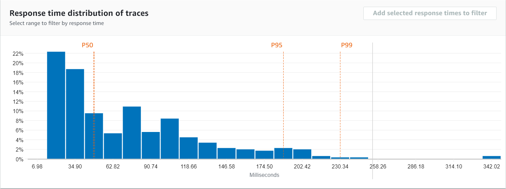
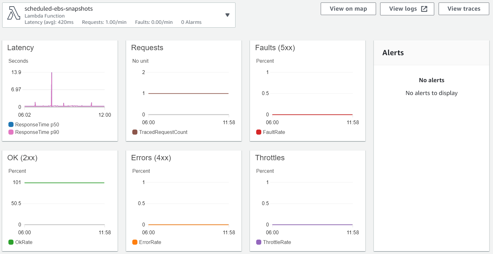
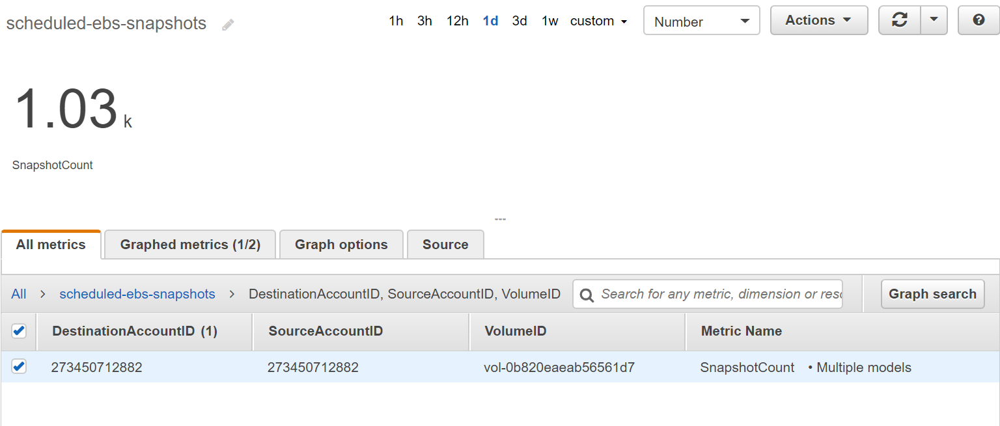

[![][sar-logo]](https://serverlessrepo.aws.amazon.com/applications/arn:aws:serverlessrepo:us-east-1:273450712882:applications~scheduled-ebs-snapshots)

[sar-deploy]: https://img.shields.io/badge/Serverless%20Application%20Repository-Deploy%20Now-FF9900?logo=amazon%20aws&style=flat-square
[sar-logo]: https://img.shields.io/badge/Serverless%20Application%20Repository-View-FF9900?logo=amazon%20aws&style=flat-square

# scheduled-ebs-snapshots
>Create snapshots of Amazon Elastic Block Storage volumes, with cross-account support.

This AWS Serverless Application Repository application aims to solve some of the limitations present in Amazon Data Lifecycle Manager, related to managing the lifecycle of EBS volumes and their snapshots.

## Features
1. Configurable intervals on when to create snapshots of EBS Volumes
2. Cross-account snapshot support
3. Custom Amazon CloudWatch metrics to assist in managing snapshots across various accounts
4. AWS X-Ray integration
5. Free!

## Usage
Prerequisites:
1. An EBS volume to be snapshotted.

### Deploying the Lambda
It is recommended that you deploy this Lambda function directly from the AWS Serverless Application Repository. It is also possible to deploy the function using the [SAM CLI](https://aws.amazon.com/serverless/sam/) or through CloudFormation via the [AWS CLI](https://aws.amazon.com/cli/). 


|Region                                        |Click and Deploy                                                                                                                                 |
|----------------------------------------------|-------------------------------------------------------------------------------------------------------------------------------------------------|
|**US East (Ohio) (us-east-2)**                |[![][sar-deploy]](https://deploy.serverlessrepo.app/us-east-2/?app=arn:aws:serverlessrepo:us-east-1:273450712882:applications/scheduled-ebs-snapshots)     |
|**US East (N. Virginia) (us-east-1)**         |[![][sar-deploy]](https://deploy.serverlessrepo.app/us-east-1/?app=arn:aws:serverlessrepo:us-east-1:273450712882:applications/scheduled-ebs-snapshots)     |
|**US West (N. California) (us-west-1)**       |[![][sar-deploy]](https://deploy.serverlessrepo.app/us-west-1/?app=arn:aws:serverlessrepo:us-east-1:273450712882:applications/scheduled-ebs-snapshots)     |
|**US West (Oregon) (us-west-2)**              |[![][sar-deploy]](https://deploy.serverlessrepo.app/us-west-2/?app=arn:aws:serverlessrepo:us-east-1:273450712882:applications/scheduled-ebs-snapshots)     |
|**Asia Pacific (Hong Kong) (ap-east-1)**      |[![][sar-deploy]](https://deploy.serverlessrepo.app/ap-east-1/?app=arn:aws:serverlessrepo:us-east-1:273450712882:applications/scheduled-ebs-snapshots)     |
|**Asia Pacific (Mumbai) (ap-south-1)**        |[![][sar-deploy]](https://deploy.serverlessrepo.app/ap-south-1/?app=arn:aws:serverlessrepo:us-east-1:273450712882:applications/scheduled-ebs-snapshots)    |
|**Asia Pacific (Seoul) (ap-northeast-2)**     |[![][sar-deploy]](https://deploy.serverlessrepo.app/ap-northeast-2/?app=arn:aws:serverlessrepo:us-east-1:273450712882:applications/scheduled-ebs-snapshots)|
|**Asia Pacific (Singapore)	(ap-southeast-1)** |[![][sar-deploy]](https://deploy.serverlessrepo.app/ap-southeast-1/?app=arn:aws:serverlessrepo:us-east-1:273450712882:applications/scheduled-ebs-snapshots)|
|**Asia Pacific (Sydney) (ap-southeast-2)**    |[![][sar-deploy]](https://deploy.serverlessrepo.app/ap-southeast-2/?app=arn:aws:serverlessrepo:us-east-1:273450712882:applications/scheduled-ebs-snapshots)|
|**Asia Pacific (Tokyo) (ap-northeast-1)**     |[![][sar-deploy]](https://deploy.serverlessrepo.app/ap-northeast-1?app=arn:aws:serverlessrepo:us-east-1:273450712882:applications/scheduled-ebs-snapshots) |
|**Canada (Central)	(ca-central-1)**           |[![][sar-deploy]](https://deploy.serverlessrepo.app/ca-central-1/?app=arn:aws:serverlessrepo:us-east-1:273450712882:applications/scheduled-ebs-snapshots)  |
|**EU (Frankfurt) (eu-central-1)**             |[![][sar-deploy]](https://deploy.serverlessrepo.app/eu-central-1/?app=arn:aws:serverlessrepo:us-east-1:273450712882:applications/scheduled-ebs-snapshots)  |
|**EU (Ireland)	(eu-west-1)**                  |[![][sar-deploy]](https://deploy.serverlessrepo.app/eu-west-1/?app=arn:aws:serverlessrepo:us-east-1:273450712882:applications/scheduled-ebs-snapshots)     |
|**EU (London) (eu-west-2)**                   |[![][sar-deploy]](https://deploy.serverlessrepo.app/eu-west-2/?app=arn:aws:serverlessrepo:us-east-1:273450712882:applications/scheduled-ebs-snapshots)     |
|**EU (Paris) (eu-west-3)**                    |[![][sar-deploy]](https://deploy.serverlessrepo.app/eu-west-3/?app=arn:aws:serverlessrepo:us-east-1:273450712882:applications/scheduled-ebs-snapshots)     |
|**EU (Stockholm) (eu-north-1)**               |[![][sar-deploy]](https://deploy.serverlessrepo.app/eu-north-1/?app=arn:aws:serverlessrepo:us-east-1:273450712882:applications/scheduled-ebs-snapshots)    |
|**Middle East (Bahrain) (me-south-1)**        |[![][sar-deploy]](https://deploy.serverlessrepo.app/me-south-1/?app=arn:aws:serverlessrepo:us-east-1:273450712882:applications/scheduled-ebs-snapshots)    |
|**South America (Sao Paulo) (sa-east-1)**     |[![][sar-deploy]](https://deploy.serverlessrepo.app/sa-east-1/?app=arn:aws:serverlessrepo:us-east-1:273450712882:applications/scheduled-ebs-snapshots)     |
|**AWS GovCloud (US-East) (us-gov-east-1)**    |[![][sar-deploy]](https://deploy.serverlessrepo.app/us-gov-east-1/?app=arn:aws:serverlessrepo:us-east-1:273450712882:applications/scheduled-ebs-snapshots) |
|**AWS GovCloud (US-West) (us-gov-west-1)**    |[![][sar-deploy]](https://deploy.serverlessrepo.app/us-gov-west-1/?app=arn:aws:serverlessrepo:us-east-1:273450712882:applications/scheduled-ebs-snapshots) |

### Configuration
Example parameter values:

| Parameter                  | Value                                      |
| ---------------------------|--------------------------------------------|
| Interval                   | 1                                          |
| IntervalUnit               | week                                       |
| Region                     | us-east-1                                  |
| VolumeID                   | vol-0b820eaeab56561d7                      |
| CrossAccountRoleArn        | arn:aws:iam::123456789012:role/SampleRole  |
| CrossAccountRoleExternalID | SampleExternalID                           |

### Cross-account Configuration
If the target EBS volume exists within a different account, create a third-party (cross-account) role and grant it the folllowing permissions to the account that will be running the lambda function. Include an external ID to follow best practices.
```json
{
    "Version": "2012-10-17",
    "Statement": [
        {
            "Effect": "Allow",
            "Action": [
                "ec2:CreateSnapshot", 
                "ec2:CreateTags"
            ],
            "Resource": "*"
        }
    ]
}
```

Click [here](https://console.aws.amazon.com/iam/home?region=us-east-1#/roles$new?step=type&roleType=crossAccount&isThirdParty&accountID=YourAccountID&externalID=YourExternalID) for an example in the IAM console.

If the volume exists within the same account as the Lambda function, then the `CrossAccountRoleArn` and `CrossAccountRoleExternalID` can be left empty. 

## Contributing
Have an idea for a feature to enhance this serverless application? Open an [issue](https://github.com/swoldemi/scheduled-ebs-snapshots/issues) or [pull request](https://github.com/swoldemi/scheduled-ebs-snapshots/pulls)!

### Development
This application has been built and testing against [Go 1.13](https://golang.org/dl/) and the latest version of the [Serverless Application Model CLI](https://github.com/awslabs/aws-sam-cli)

```
make check
make test
make build
make sam-package
make sam-deploy
make sam-tail-logs
make destroy
```

## To Do
1. Account for the 100,000 EBS snapshot quota
2. Backoff strategies for large volume snapshots to account for the limit on the number of concurrently active `pending` snapshots.
    - Answer: What does the distribution look like, given a certain interval?
    - Answer: Is it worth cleaning up snapshots, given new snapshots are incremental/successive?
3. Performance/memory tuning.

## References
Automating the Amazon EBS Snapshot Lifecycle: https://docs.aws.amazon.com/AWSEC2/latest/UserGuide/snapshot-lifecycle.html


## Screenshots
>Example latency percentiles as reported by X-Ray traces after ~200 events


>Example CloudWatch Service Map Dashboard for the Lambda


>Custom cloudwatch metric reporting Snapshot count with dimensions for where they came from and where they went


## License
[MIT No Attribution (MIT-0)](https://spdx.org/licenses/MIT-0.html)